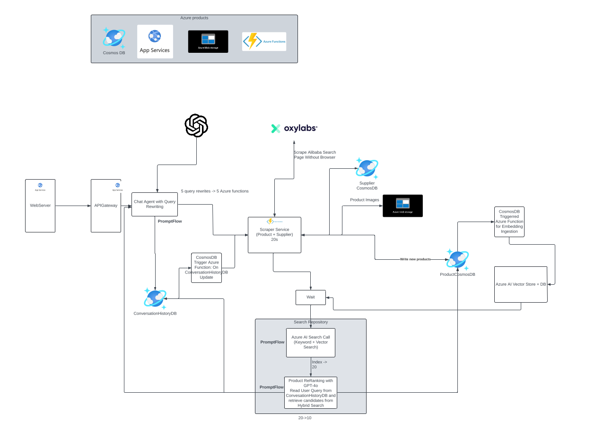

# AI Fashion Search Engine

An advanced AI-driven search engine designed to connect fashion suppliers and buyers through intelligent search and conversational interaction. This system leverages Large Language Models (LLMs) and Hybrid Multimodal Retrieval-Augmented Generation (RAG) to find and rank fashion products based on user queries, overcoming challenges related to keyword variations, image mismatches, and customization needs.

## 🎯 Problem Statement

Fashion suppliers often use diverse and SEO-optimized keywords that do not align with buyers' search intent. Additionally, images may not always convey the specific product features a buyer seeks. This creates a communication gap and makes it difficult for buyers to find exactly what they need. Our goal was to build an AI-powered search engine that enables seamless product discovery and enhances supplier-buyer interactions.

## 💡 Solution

We've developed an AI-powered conversational search AI agent  that:

- Allows users to converse with the search engine to refine queries and find the most relevant products.
- Bridges the communication gap between suppliers and buyers by understanding natural language queries and product descriptions.
- Supports multimodal search, integrating text, image, and vector-based search for comprehensive product discovery.
- Enables efficient supplier onboarding, helping them list their products with optimized searchability.

## 🔑 Key Features

- **Hybrid Multi-modal RAG System**
  - Combined text, vector, and image search capabilities
  - Intelligent ranking based on query relevance
  - Conversational interface for refined search

- **Smart Product Discovery**
  - Natural language understanding
  - Customization requirement matching
  - Intelligent supplier-buyer matching

- **Technical Implementation**
  - Azure AI Search integration
  - Vector search capabilities
  - Image processing and matching
  - Scalable microservices architecture

- **Microservices-Based Architecture**
    - Azure Functions for handling API logic.
    - Cosmos DB for managing structured product data.
    - Blob Storage for storing and retrieving product images.
    - Vector Search to enhance relevance ranking and retrieval.

- **Seamless Deployment and Performance Optimization**
    - Fully managed on Azure Cloud, ensuring high availability and real-time response.

## 🏗️ Architecture

## 🎥 Demo

<!-- Option 1: Direct video embed -->
[https://user-images.githubusercontent.com/YOUR_USER_ID/AI_Search_Engine/assets/123456789/your-video-id](https://github.com/user-attachments/assets/c654bede-6dfd-4f92-a741-108887c915d4

## 🛠️ Technology Stack

- **Azure Services**
  - Azure AI Search
  - Azure Machine Learning
  - Azure Functions
  - Cosmos DB
  - Blob Storage
  - PromptFlow

## 💫 Impact

- Enhanced product discovery accuracy
- Improved supplier-buyer communication
- Streamlined onboarding process
- Efficient customization requirement matching

## 🚀 Deployment

The system is fully deployed on Azure with:
- Scalable microservices architecture
- Robust logging system
- Efficient vector storage
- Optimized search functionalities

## 🔄 Development Workflow

1. User query processing
2. Multi-modal search execution
3. Result ranking and filtering
4. Conversational response generation
5. Continuous feedback integration

---

*Note: This project was developed as part of a US-based startup initiative where I served as an AI/ML Engineer.*
